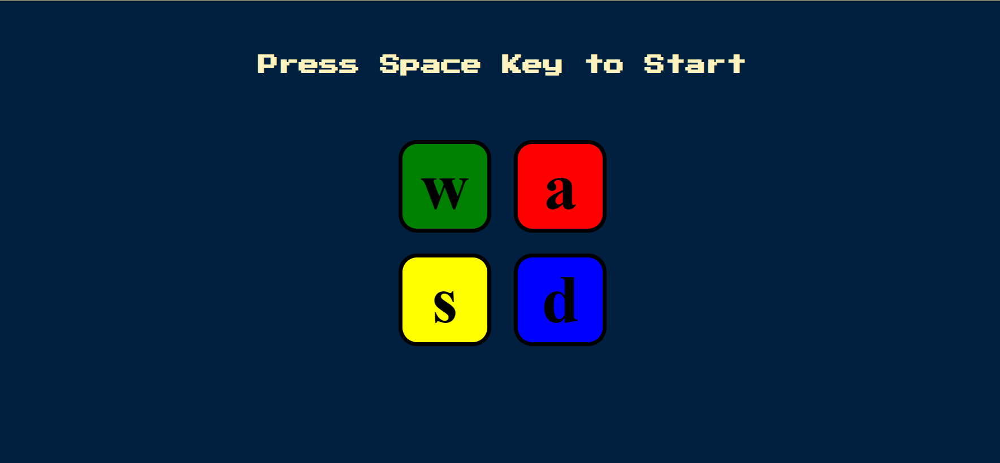
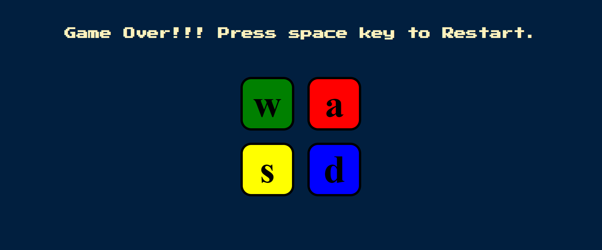

# 🎮 [Simon Game](https://yashwanth-al.github.io/Simon-Game/)
Click the link above to experience the game in action!

Simon Game is a simple memory game built using **HTML**, **CSS**, and **JavaScript**. It tests the player's memory by generating a random sequence of colors and sounds, which the player must replicate in the correct order.

---

## How to Play 🕹️

1. Press the **Space Bar** to start the game in laptops and PC's. 
2. Press the Empty Screen in Mobile phone to start the game.
3. Watch the color sequence that appears on the screen.
4. Use the corresponding keys (W, A, S, D) or the Arrow Keys or touch those buttons to repeat the sequence in the correct order.

With each correct sequence, the game will add a new color, increasing the difficulty.

---

## Features 🌟

- **Dynamic and Responsive Interface**: Engages players with smooth animations.
- **Increasing Difficulty**: The sequence grows with each round.
- **Supports WASD and Arrow Keys**: Play the way you prefer.
- **Memory Challenge**: A fun test for your brain!

---

## Technologies Used 💻

- **HTML**: Structure of the game.
- **CSS**: Styling and animations.
- **JavaScript (jQuery)**: Game logic and interactions.

---

Feel free to [clone the repository](https://github.com/Yashwanth-AL/Simon-Game) and try it out!

